### Universidad de San Carlos
### Sistemas Operativos 1
### Grupo 22
### Primer Semestre 2022
### Proyecto 1 Fase 2

# Manual Técnico

Se implemento la arquitectura mostrada posteriormente en el apartado de arquitectura, utilizando para ella la nube de google, además de distintos lenguajes de programación y bases de datos NO SQL, los cuales se detallan más adelante. 

El proyecto simula la implementación de diversos juegos, 5 para ser exactos, y en donde por medio de un archivo de entrada se simula la cantidad de jugadores, y que juego jugarán, en el front-end final podremos observar los resultados de los juegos en tiempo real y los reportes solicitados.

## Arquitectura
La arquitectura utilizada es la siguiente:
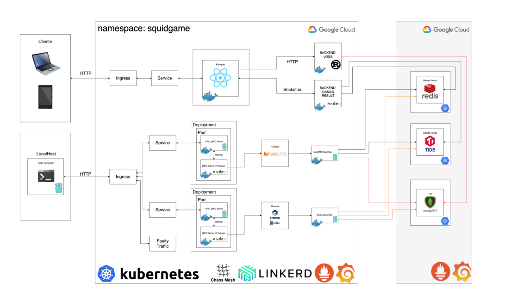

## Herramientas de Google Cloud Utilizadas
Los diferentes servicios y herramientas de google cloud utilizados son los siguientes:

* <b> Kubernetes: </b> Kubernetes es una plataforma portable y extensible de código abierto para administrar cargas de trabajo y servicios. Kubernetes facilita la automatización y la configuración declarativa. Tiene un ecosistema grande y en rápido crecimiento

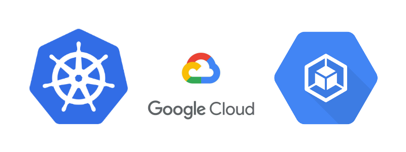
* <b>Load Balancer: </b> Esta herramienta se utilizó la distribución de las peticiones de locust.
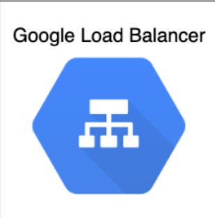

* <b>GRCP</b>
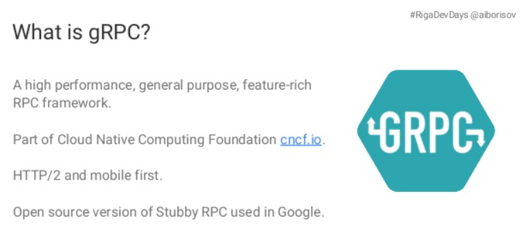

* <b>GCP virtual machines</b> Este servicio se utilizó para crear los servidores para las distintas funcionalidades y en disintos lenguajes de programación, también para la creación y almacenamiento de las bases de datos
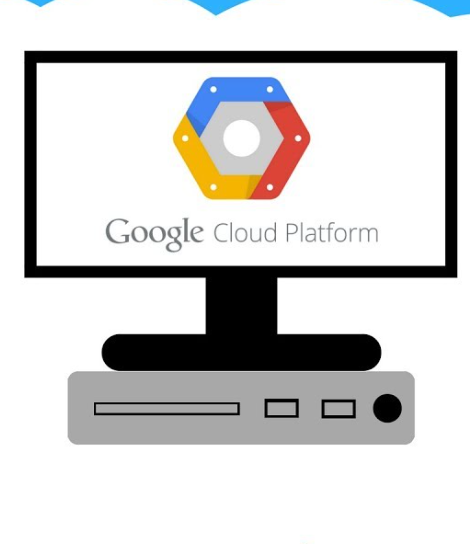

## Lenguajes de Programación
*  <b>Python Locust</b> Este lenguaje se utilizó para simular los juegos y las peticiones a los servers.
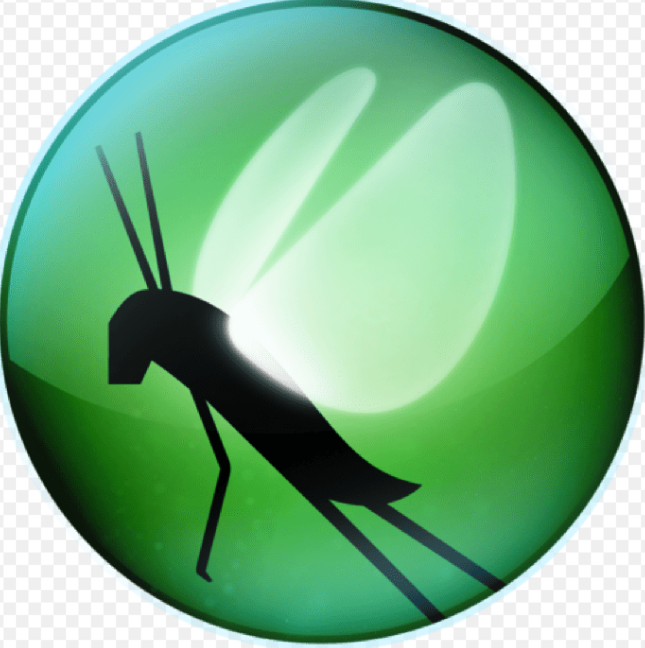

* <b>Golang</b> Este lenguaje se utilizó para como cliente y servidor de GRCP. Tambien como suscriber de kafka y rabbit y para conectar y almacenar los datos en las 3 bases de datos.

* <b>Go rutines: </b>  En el lenguaje Go, cada unidad de ejecución concurrente se denomina goroutine. Simplemente puede comparar una goroutine con un hilo.

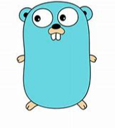

* <b>Rust</b> Este lenguaje se utilizó para ir a traer los datos de los logs a mongodb
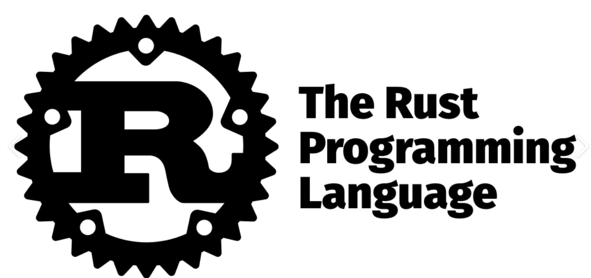

* <b>NodeJS</b> Este lenguaje se utilizó como cliente y servidor de GRCP, tambien como server en app engine para ir a traer los datos de redis y TIDB en tiempo real de los resultados.
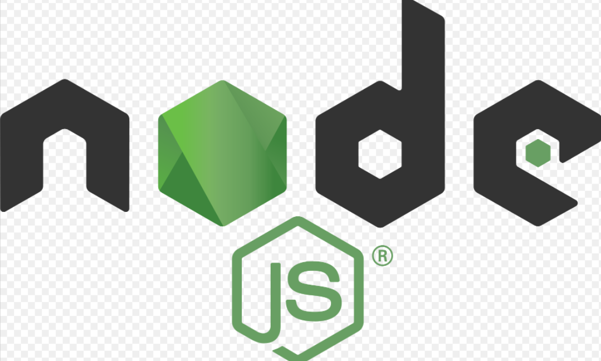

* <b>ReactJS</b> Este framework se utilizó para realizar la página web final para mostrar los datos. 
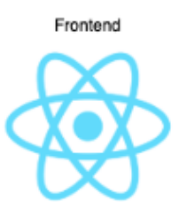

* <b>Docker</b> Docker se utilizó para poder crear las bases de datos en la VM además de que la mayoría de código se encuentra dockerisado como por ejemplo los server y clientes de GRCP.  
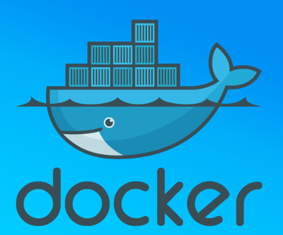

* <b>Linkerd</b> Linkerd es un proxy de red open source diseñado para ser desplegado como Service Mesh y que está basado en finagle y netty. Una malla de servicios como Linkerd, por ejemplo, puede cifrar automáticamente conexiones; gestionar reintentos de solicitudes y tiempos de espera; proporcionar información de telemetría, como tasas de éxito y latencias; y más.
  

## Bases de datos
* <b>MongoDB</b> Esta base de datos no SQL, permite almacenar un gran cantidad de registros sin importar su estructura, se utilizó para almacenar los logs de las peticiones de los juegos.

* <b>TIDB</b> Esta base de datos usa la sintaxis y conexión de MYSQL pero almacena los datos como que si fuera no SQL y permite almacenar grandes cantidades de datos además de tener una gran facilidad de escalabilidad. Esta base de datos se ultilizó para almacenar los resultados de los juegos.
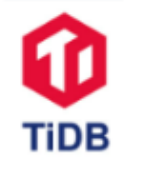

* <b>Redis</b> Esta base de datos es de tipo clave valor y permite poner tiempo que permanecerán los datos guardados además de almacenar millones de datos, se utilizó para almacenar los resultados de los juegos. 
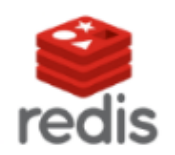

## Redis vs TIDB
Redis demostro tener una mayor velocidad además de responder de manera eficiente a pesar de tener muchos clientes conectados.
Sin embargo el escalimiento de TIDB es mejor

Para el presente proyecto tambien caba recalcar que fue de mayor utilidad TIDB ya que para la elaboración de los reportes, se pudo extraer la información necesaria sin la necesidad de hacer mayor transformación a la información. 
Sin embargo redis, al ser clave valor no permite operaciones con los valores al momento de extraer la información y se tuvo que realizar diferentes algoritmos para transformarla y obtener los reportes solicitados.
