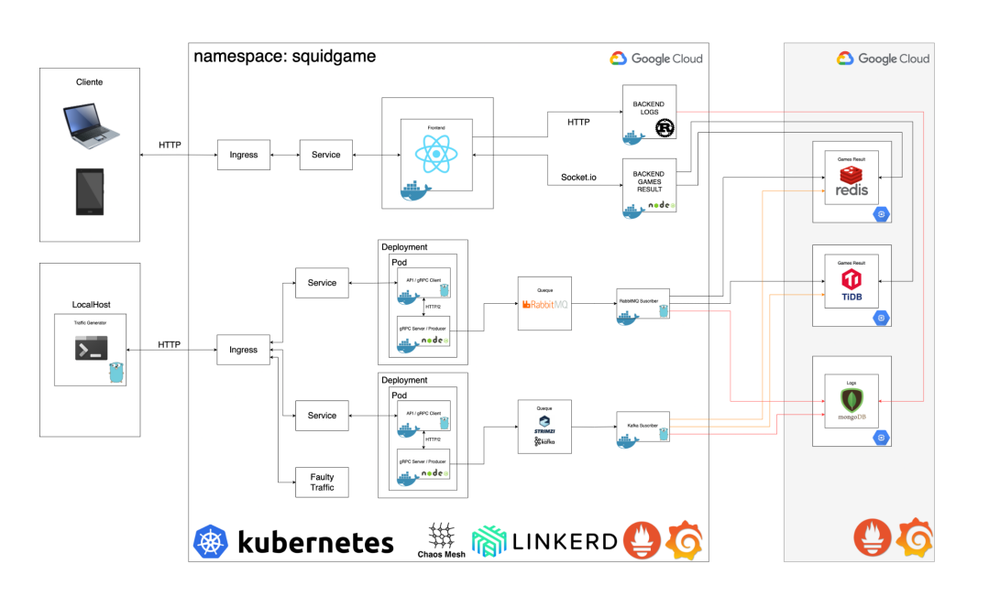

### Universidad de San Carlos
### Sistemas Operativos 1
### Grupo 22
### Primer Semestre 2022
### Proyecto 1 Fase 3

# Manual de Usuario
Se implementó la arquitectura mostrada posteriormente en el apartado de arquitectura, utilizando para ella la nube de google, además de distintos lenguajes de programación y bases de datos NO SQL, los cuales se detallan más adelante. 

El proyecto simula la implementación de diversos juegos, 5 para ser exactos, y en donde por medio de un archivo de entrada se simula la cantidad de jugadores, y que juego jugarán, en el front-end final podremos observar los resultados de los juegos en tiempo real y los reportes solicitados.

Para obtener los reportes y la información solicitada, por parte del cliente no se debe realizar ninguna operación ni se piden ingresos de datos, esta información se obtiene sola desde la arquitectura y se carga con locust y los diferentes servicios de GCP.

## :white_check_mark: Arquitectura
La arquitectura utilizada es la siguiente:

Para el presentente proyecto tenemos la siguiente interfaz integrada:

## Vistas Aplicación
### :white_check_mark: Logs
La vista de logs obtenidos de mongodb es la siguiente:

### :white_check_mark: Top 10 Jugadores
El reporte de los 10 mejores jugadores obtenido en redis y tidb es la siguiente:

### :white_check_mark: Últimos 10 Juegos
El reporte de los ultimos 10 juegos obtenido en redis y tidb es la siguiente:

### :white_check_mark: Prometeus - Grafana
Para poder visualizar el rendimiento de Tidb y Redis utilizando prometheus y grafana podemos utlizar los siguientes enlaces:

[Tidb](http://34.121.144.21:3000/d/duZDK3y7k/tidb-cluster-overview?orgId=1)
[Redis](http://35.192.211.93:3000/d/DNTTc7Q7k/redis-dashboard-for-prometheus-redis-exporter-1-x?orgId=1&refresh=30s)

#### :white_check_mark: Vista Dashboard Redis

#### :white_check_mark: Vista Dashboard Tidb

